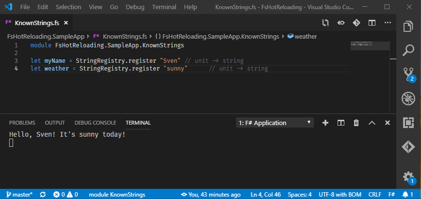

# FsHotReloading
**An experimental library that provides hot reloading to any F# app for any purpose.**

## Core Concepts
* FsHotReloading is built around the concept of global *registries*. For each kind of value that should be hot-reloadable, declare a registry. The sample app declares a single `StringRegistry` for hot-reloadable `string` values.
* Each registry has its own way of identifying registered values. The `StringRegistry` in the sample app uses the type `StringId` as identifier which is simply a pair of a file path and a name. Whatever you choose as identifer, the file path *must* be part of it so that the system knows which files to watch for changes.
* When the system detects that a file with registered values has changed, it re-evaluates that file via F# Interactive (FSI). During the whole lifetime of your app, a single FSI session is kept open. The session references the same assemblies as your running app.
* On startup, the hot reloading system must be initialized via `HotReloading.enable`, specifying all the registries. If hot reloading is not initialized like this, your app can still interact with all the registries and registered values, but files are not watched for changes and no FSI session is created. This is important since you probably only want to enable hot reloading in debug builds, not in release builds.

## Status
This is an experimental project, mostly for learning purposes.  
It is not well tested and not production-ready. Use at your own risk.